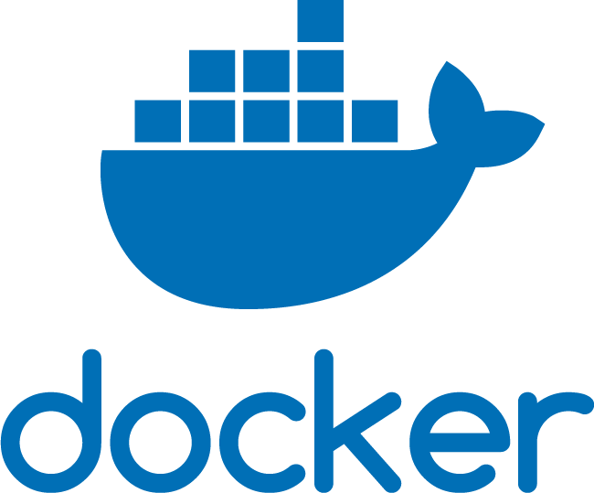
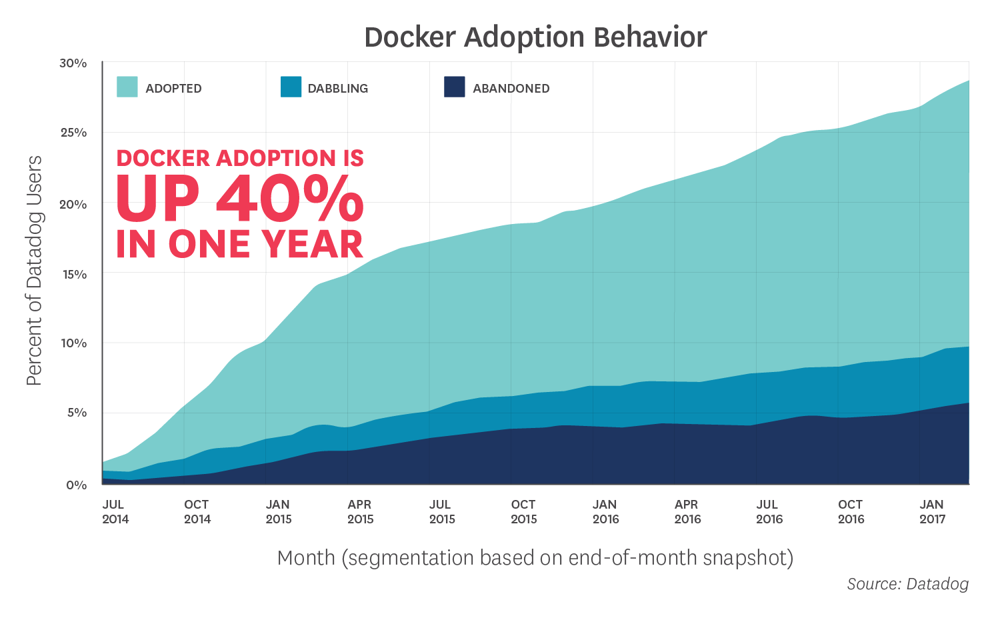
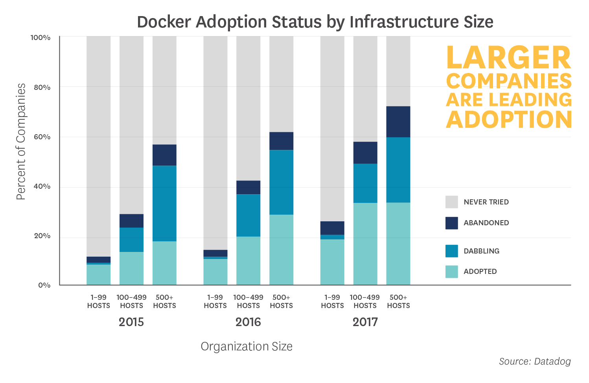
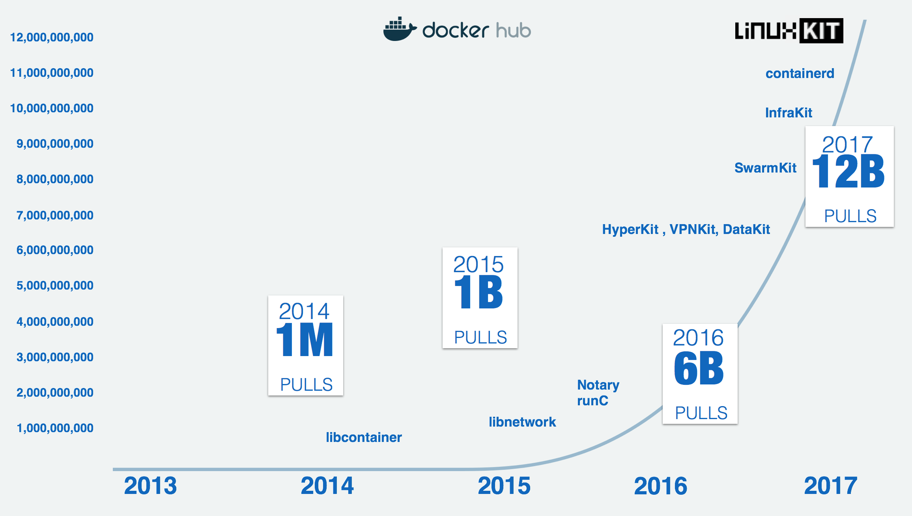
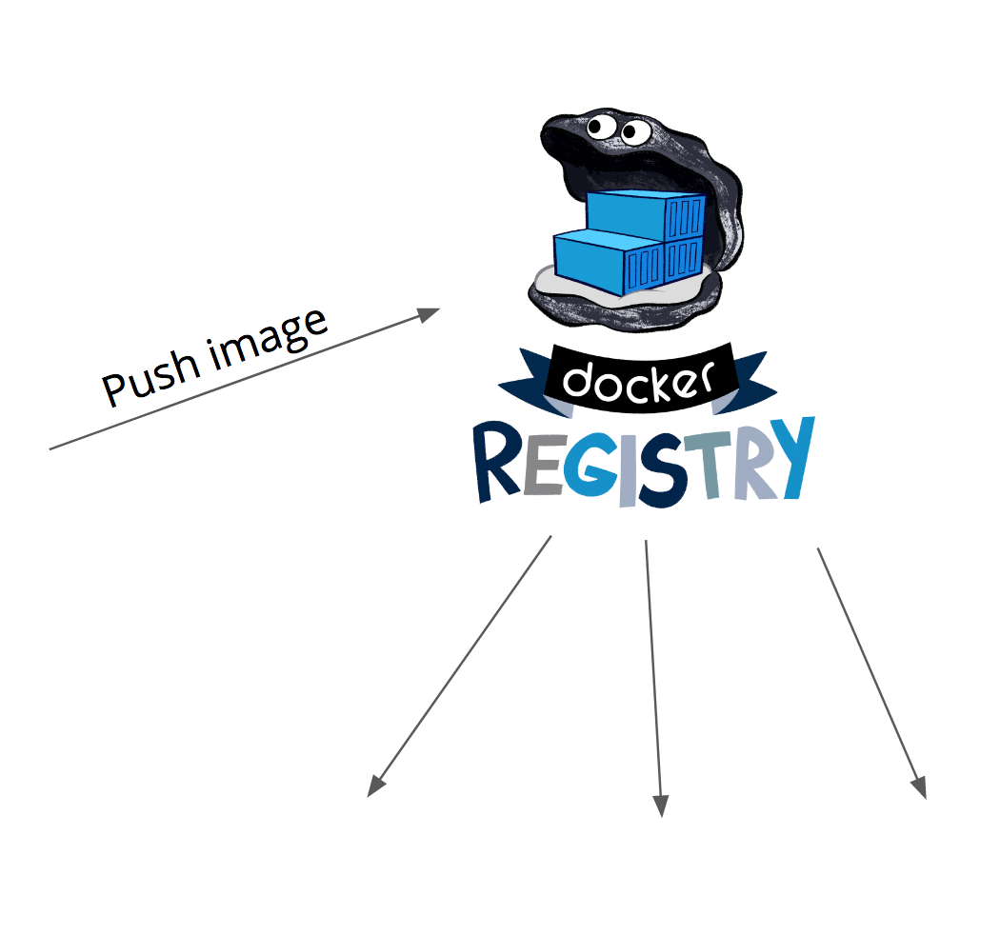
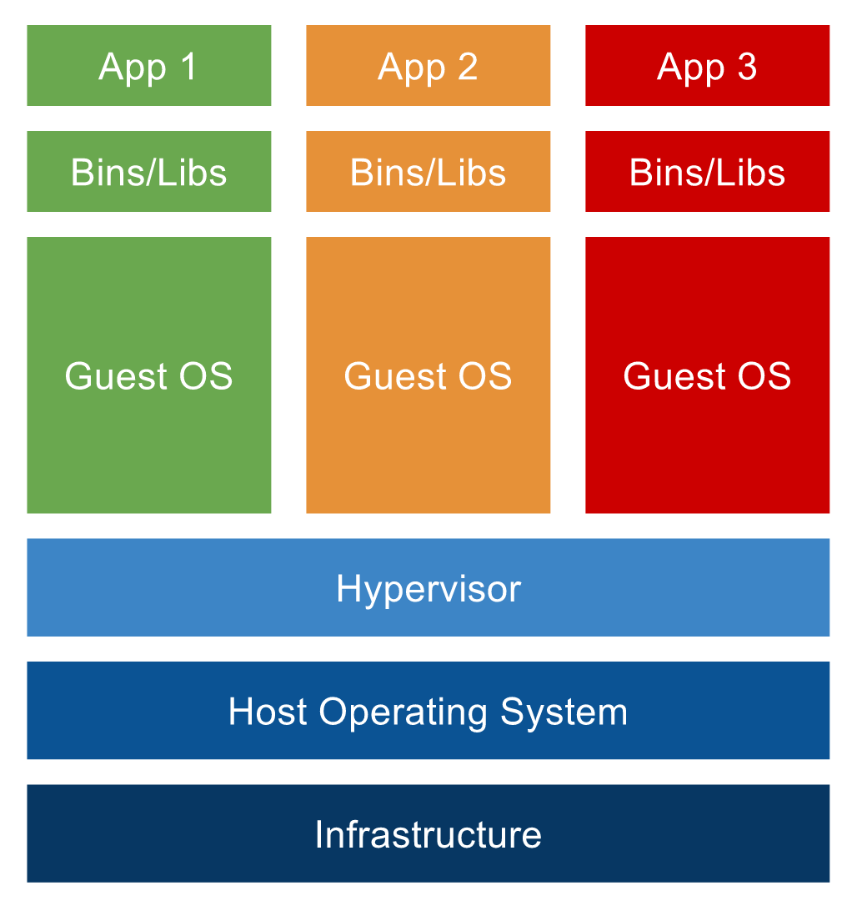
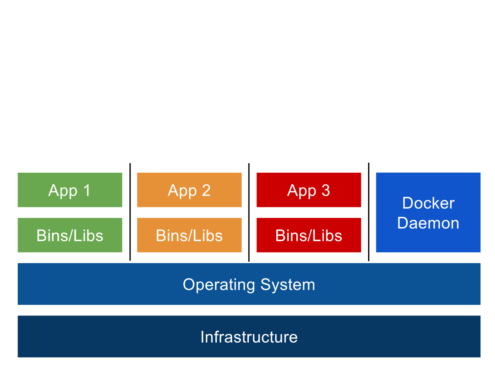
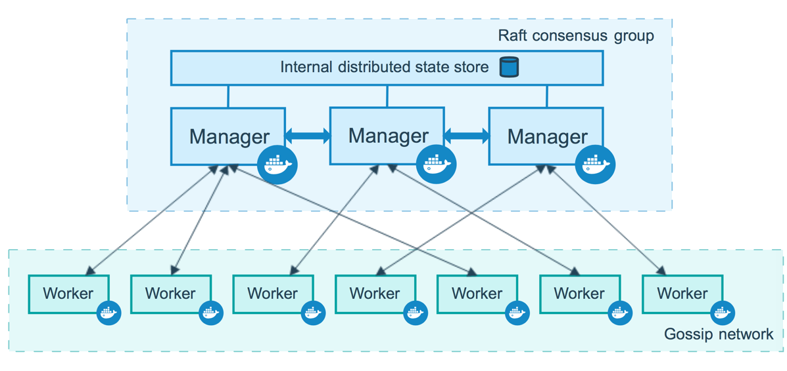
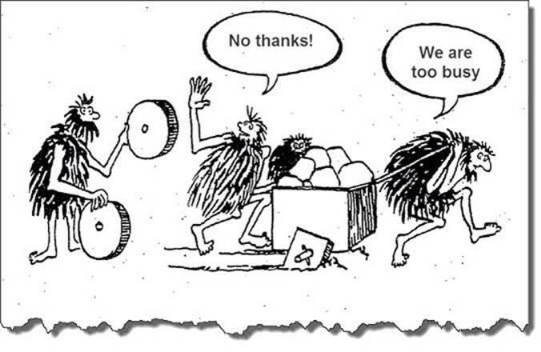

class: center, middle, title-slide

# What's the Hype with Docker?
### June 22, 2017
### Michael Irwin

.logo[

]

---
class: about-me

## About Me

.row[
  .col-xs-8[
- 2011 - started full-time at VT
- 2014 - assigned to work on Summit
- August 2016 - rolled out Summit to all of VT
  - First production IT project using Docker
  - First production IT project deployed on AWS
  ]
  .col-xs-3.col-xs-push-1[
    
  ]
]

--

.row[
  .col-xs-8[
- Sept 2015 - Started using Docker for QA env
- June 2016 - Attended first DockerCon
- Sept 2016 - Started Blacksburg Docker Meetup
- Mar 2017 - recognized as a Docker Captain
  ]
  .col-xs-3.col-xs-push-1[
    
  ]
]

---
class: middle, center, inverse

## Start with some numbers!

---
class: middle, center, full-size-image



???
- Datadog sampling of 10,000 companies in April 2017
- Shows that many companies are at least interested
- Some have abandoned, but that line is moving very much


---
class: middle, center, full-size-image



???
- Another graph from Datadog's sampling
- Very large companies are using it, not just small startups

---
class: middle, center, full-size-image



---
class: middle, center, inverse

## What's causing all of the hype?

???
That's a great question. So, in response to that question, another question!

---
background-image: url(images/homer.png)
background-position: right bottom
background-size: 63%
class: middle, center

.row[
  .col-xs-5.col-xs-offset-1.text-right[
    ## How do you _build_, _ship_, and _run_ your applications in your org/business?
  ]
]


---
class: middle, center

<h2 style="margin-bottom:0px;">Let's start a smartphone company!</h2>

<div class="text-muted">
  (What could possibly go wrong?)
</div>

---
class: phone-1

<div id="phone">
  <div class="marvel-device iphone5c blue" style="padding:30px 22px;height:708px;">
      <div class="top-bar"></div>
      <div class="camera" style="top:13px;"></div>
      <div class="volume"></div>
      <div class="screen" style="border-radius:20px;"></div>
      <div class="overlay"></div>
      <div class="component battery"><span>Battery</span></div>
      <div class="component cpu"><span>CPU</span></div>
      <div class="component camera-module"><span>Camera</span></div>
      <div class="component storage"><span>Storage</span></div>
      <div class="component wifi"><span>WiFi/BT</span></div>
  </div>  
</div>


--
class: show-overlay

--
class: move-to-left phone-on-left

.software-display[
Our customized OS is:
- Rock-solid secure
- Super fast and reliable
- Designed for users
]

--
class: ship-it

<div class="package"></div>
<div class="right-arrow-wrapper">
  <div class="right-arrow"></div>
</div>
<div class="users text-center">
  <i class="fa fa-users fa-3x"></i>
  <br />End users
</div>


---
class: center, middle

# Why wouldn't this work?

--
<div class="wait-50 animate-3s text-muted" style="position: absolute;top:45px;left:190px" >Well, it worked in R&amp;D...</div>
<div class="wait-50 text-muted" style="position:absolute;bottom:200px;right:80px;">We don't have that component model!</div>
<div class="wait-66 animate-3s text-muted" style="position:absolute;top:150px;right:115px;">Can we just reuse our old hardware?</div>
<div class="wait-66 animate-2s text-muted" style="position:absolute;bottom:85px;left:115px;">I'm going to try it my own way</div>
<div class="wait-50 animate-2s text-muted" style="position:absolute;top:200px;left:35px;">How do I find a case for this?</div>

---
class: center, middle

## But that's obviously dumb
.text-muted[
  We would _never_ do that... right?
]


???
Unfortunately, that's _exactly_ what we do in software.


---
class: phone-1 phone-on-left visible-overlay visible-components

<div id="phone">
  <div class="marvel-device iphone5c blue" style="padding:30px 22px;height:708px;">
      <div class="top-bar"></div>
      <div class="camera" style="top:13px;"></div>
      <div class="volume"></div>
      <div class="screen" style="border-radius:20px;"></div>
      <div class="overlay"></div>
      <div class="component battery"><span class="phone">Battery</span><span class="app">Third-party libraries</span></div>
      <div class="component cpu"><span class="phone">CPU</span><span class="app">Apache</span></div>
      <div class="component camera-module"><span class="phone">Camera</span><span class="app">PHP with modules</span></div>
      <div class="component storage"><span class="phone">Storage</span><span class="app">App source</span></div>
      <div class="component wifi"><span class="phone">WiFi/BT</span><span class="app">Other libraries</span></div>
  </div>  
</div>


???
- Let us go back to our phone example where we have all of our components. But, let's swap them out....

--
class: hide-phone-and-show-app

<div class="software-display visible">
  <p>Our software...</p>
  <ul>
    <li>Solves a business problem</li>
    <li>Is coupled to environment</li>
  </ul>
</div>


???

- Instead of phone parts, we have various pieces that make up software
- We use Apache with modules, PHP with its modules, other third-party libraries, etc.
- This is the same for ALL language frameworks

--
class: ship-it

<div class="package"></div>
<div class="right-arrow-wrapper">
  <div class="right-arrow"></div>
</div>
<div class="users text-center">
  <i class="fa fa-database fa-3x"></i>
  <br />Code Repo
</div>

???
- Yet, we only ship the code around.
- What makes this even harder is shipping an artifact looks different based on the language...
  - Java => ship a WAR file, maybe using Nexus?
  - PHP => ship source code, possibly needing a Composer install
  - Node => ship source code, possibly needing node_modules to be installed

---
class: center, middle

# Why doesn't this work?

--
<div class="wait-50 animate-3s text-muted" style="position: absolute;top:45px;left:190px" >It worked on my machine...</div>
<div class="wait-50 text-muted" style="position:absolute;bottom:200px;right:80px;">We don't have that Apache version!</div>
<div class="wait-66 animate-3s text-muted" style="position:absolute;top:150px;right:25px;">Where's the documentation?!?</div>
<div class="wait-66 animate-2s text-muted" style="position:absolute;bottom:85px;left:115px;">I'm going to try it my own way</div>
<div class="wait-50 animate-2s text-muted" style="position:absolute;top:240px;left:35px;">How do we support this new language?</div>


---
class: middle, center

<h2 style="margin-bottom:0px;">So... how do we solve this problem?</h2>

<div class="text-muted">
  (Hint... what we're here to talk about)
</div>

???
BOO!


---

## Docker Intro

> Docker provides an integrated technology suite that enables development and IT operations teams to build, ship, and run applications anywhere.


- **Build** - package an application with its dependencies and environment
- **Ship** - share the package with all deployment environments
- **Run** - run, scale, and monitor your application


---

## Introducing Docker Images

<div class="container-fluid">
  <div class="row image">
    <div class="col-xs-5">
      
      <ul style="font-size:80%">
        <li>Stateless. Immutable.</li>
        <li>Metadata provides some details</li>
      </ul>
    </div>
  </div>
</div>

--
appendTo: .image

<div class="col-xs-5 col-xs-offset-1 fade-in animate-half-second">
  <div class="image-layer-wrapper" style="margin-bottom:20px;">
    <div class="image-layer blue" style="height:245px;padding-top:100px;">php:7.1-apache</div>
  </div>
  <ul style="font-size:80%;">
    <li>Stateless. Immutable.</li>
    <li>Metadata provides some details</li>
  </ul>
</div>


---

## What actually _is_ an image?

.row[
  .col-xs-7.no-pad-code[
- A collection of layers
- Each layer contains...
  - Metadata, including an optional reference to a parent layer
  - A tar with the filesystem diff from its parent
  - Optional cryptographic signature of the metadata
  ]
  .col-xs-4.col-xs-offset-1[
.image-layer-wrapper.condensed[
  .image-name[ php:7.1-apache ]
  .image-layer[ Debian base ]
  .image-layer[ Apache 2.4 ]
  .image-layer[ PHP 7.1 ]
]
  ]
]

---

## Retrieving Images

- To get an image, you simply "pull" it
- Default registry is called DockerHub (hub.docker.com)
- Client will...
  1. Fetch metadata for the layer
  2. Pull all layers for the image
  3. Validate checksums

```bash
docker pull php:7.1-apache
```


---

## Building Images

- Preferred method is to use a `Dockerfile`
  - Can be included in version control with codebase

.row[
  .col-xs-6.no-pad-code[
```dockerfile
FROM php:7.1-apache
RUN docker-php-ext-install mysqli
```
  ]
]

- To build the image, use the `docker build` command:

.row[
  .col-xs-6.no-pad-code[
```bash
docker build -t php-with-mysqli .
```
  ]
]

---

## The New Image...

.row[
  .col-xs-7.no-pad-code[
```dockerfile
FROM php:7.1-apache
RUN docker-php-ext-install mysqli
```    

- Used `php:7.1-apache` as the base
- Installed the `mysqli` extension
- Gave the new layer a name of `php-with-mysqli`
  ]


  .col-xs-4.col-xs-offset-1[
.image-layer-wrapper.condensed[
  .image-layer[
    ...
  ]
  .image-layer[
     Apache 2.4
  ]
  .image-layer[
     PHP 7.1 (php:7.1-apache)
  ]  
 ]
]
]


--
appendTo: .image-layer-wrapper
.image-layer.green[
  Added `mysqli` extension
]

--
appendTo: .image-layer-wrapper
.image-name[
  php-with-mysqli
]

---

## Sharing Images

.row[
  .col-xs-7[
- Images can be pushed to a registry
- Default registry is DockerHub
  - You can run your own registry
- Registries allow images to require authorization

```bash
docker image push php-with-mysqli
```
  ]
  .col-xs-5.img-responsive[
  
  ]
]


---

## Using our new image

.row[
  .col-xs-7[
- The new image can be a new base

```dockerfile
FROM php-with-mysqli
COPY ./src /var/www/html
```    

- And build it!

```bash
docker build -t my-first-php-app .
```
  ]

  .col-xs-4.col-xs-offset-1[
.image-layer-wrapper.condensed[
  .image-layer[ ... ]
  .image-layer[ Apache 2.4 ]
  .image-layer[ PHP 7.1 (`php:7.1-apache`) ]
  .image-layer[ Installed mysqli (`php-with-mysqli`) ]
  .image-layer.green[ Copied source code ]
  .image-name[ my-first-php-app ]
 ]
]
]

---

## Running a Container

.row[
  .col-xs-6.no-pad-code[
```bash
docker container run -d -p 80:80 php:7.1-apache
```
  ]
]

.row[
  .col-xs-8[
- A _container_ is a running instance of an image
- The `docker container run` command...
  - Looks for the `php:7.1-apache` image locally
  - Unions the layers together
  - Gives the container its own writeable layer
  - Runs the image's default command
  ]

  .col-xs-4[
.image-layer-wrapper.condensed[
  .image-layer[ ... ]
  .image-layer[ Apache 2.4 ]
  .image-layer[ PHP 7.1 (`php:7.1-apache`) ]
  .image-layer.green[ Container specific layer ]
 ]
]
]

---
class: middle, center

## Demo time! Let's run a container!
.text-muted[
  Why not Ubuntu?
]

???
- Demo #1
  - `docker container run --rm -ti ubuntu:17.04` - that was fast!
  - `ls` - looks like a filesystem!
  - `cat /etc/lsb-release` - looks like ubuntu!
  - `curl vt.edu` - hmm... not there
  - `apt-get update && apt-get install -y curl`
  - `curl vt.edu` - it works now!
  - Kill the container and restart
  - Will curl work this time?!?

---
class: middle, center

## Mind blown yet?


---

## VMs vs Containers

.row[
  .col-xs-5.img-responsive[
    
  ]
]

--
appendTo: .row
.col-xs-7.img-responsive[
  
]


---

## Containers more in-depth

- Creates unioned filesystem
  - Image (and all of its layers) is mounted read-only
  - A writeable container-specific layer is added
- Namespaces (process, network, storage, user, IPC, etc.) are created
- Default command is executed (can be overridden)

End effect... a container is created and it looks and feels completely isolated!

---
class: middle, center

## Another demo please?
.text-muted[
  Sure thing! Let's look at a namespace
]

???
- Demo #2
  - `ps aux`
  - `docker run --name sleeper -dt ubuntu:17.04 bash -c "(sleep 30 &); ps aux; sleep 30"` - start a sleeping process
  - `docker logs sleeper` - look at the PID for the bash/sleep
  - `ps aux` - notice that their different PIDs

- Ok... this was all fun, but the question then is...

---
class: middle, center, inverse

## Ok... who cares?

???
The big reason we should care is because of what this unlocks

---
background-image: url('images/phone-accessories.jpg')
background-size: contain
background-position: right
class: middle

## Tools and <br />Accessories!

???
Back to our phone analogy, once we decide to ship the entire phone, we get lots of benefits. 

- Standardized size/configuration allows accessories
- Debug issues is easier, as we have an expected environment

So, the first tool we'll look at is...

---

## Docker Compose

.row[
  .col-xs-7[
- Ability to launch multiple containers
- Declarative statement of services
- Creates a network specifically for stack
  - Provides DNS-discoverability of services
  - Isolates communications from all other containers

```bash
docker-compose up -d
```

Makes this possible (in app source)...
```php
$db = new mysqli("db", "root", "terriblePassw0rd");
```
  ]
  .col-xs-5.no-pad-code[
.text-center[<p class="mt-0"><small>docker-compose.yml</small></p>]
```yaml
version: "3.1"
services:
  app:
    image: php-with-mysqli
    ports:
      - 80:80
    volumes:
      - ./src:/var/www/html
  db:
    image: mysql:5.6
    volumes:
      - ./schema.sql:/docker-entrypoint-initdb.d/schema.sql
```
  ]
]

???
- Provides ability to define an app and its dependencies in a way that makes it easy to start it all together
- This network stuff is really cool... not going to go too deep here, but the DNS resolving is awesome (as demonstrated)


---
class: center middle

## Docker Compose in Action!
.text-muted[
  Prepare to be amazed!
]

???

- `git clone https://github.com/mikesir87/docker-lamp-demo.git`
- `cd docker-lamp-demo`
- `docker-compose up -d`
- Wait a sec for the DB to initialize and open the app (port 80)
- Make a change to the `src/index.php` file... add exclamations to the Submit button
- Refresh the browser and see it updated

---
class: middle, center

## Pretty awesome?


???
If you think that's awesome... just wait ;)

---

## Docker Swarm

.row[
  .col-xs-6[
- Cluster management
  - Determines what's running where
- Start by setting a "desired state"
  - What do you want running? How many?
- Many other great features
  - Secure communications out-of-the-box
  - Swarm Secrets
  - Routing Mesh
  - Rolling Updates
  ]
  .col-xs-6.img-responsive[

  ]
]

???
- Docker Compose is used mostly for development, where it's ok if a container dies.
- In prod, we want to keep containers running (effectively daemonizing them)
- How do we do it across multiple nodes? Enter swarm
- Awesome features...
  - Mutual TLS between all nodes (means PKI infrastructure and node identity)
  - Once you have mutual TLS, secrets can flow
  - Routing mesh ensures traffic gets to wherever an app is running (we'll that in a sec)
  - Lots of options surrounding how apps get rolled out during updates


---
class: center middle

## Docker Swarm in Action!
.text-muted[
  Live Demo #4!
]

???

- Using the same repo/project as before, start up a swarm!
- Add two instances
- `docker swarm init --advertise-addr eth0`
- Copy token and join other instances to the swarm
- Run `docker node ls` on the manager to show the cluster
- `docker stack deploy -c docker-stack.yml groceries`
- While that's spinning up, look at the `docker-stack.yml`
  - Only differences are using images and deploy config (note replica count)
- Open the app
- Swap between the instances and show that containers are (most likely) on different nodes
- Open port 80 on a node that does NOT have the app running. Routing mesh in action!

---
class: middle, center

## Think it's awesome now?!?


---
class: middle, center


???
Going to talk about a few specific things that using Docker changes for our organizations and processes


---
class: white-text
background-image: url(images/lotr-ring.jpg)
background-size: cover

.photo-credit[
http://lotrminecraftmod.wikia.com/wiki/File:The-one-ring.jpg
]


## One Environment to Rule Them All

---

## Consistency Across all Tiers

- Developers now pull environment, rather than installing it
  - Spin-up time is _significantly_ faster and more reliable
- Development can be done directly in a container
- Same environment is then used in all other tiers
  - Provides assurances things will work everywhere
  - Makes debugging easier

---

## Using Docker in Builds

- Standard build servers require build tools/languages to be installed
- Imagine a build where...
  1. A container containing build tools is started
  2. Code is checked out into container
  3. The build/tests run
  4. Any necessary artifacts extracted
  4. Container is thrown away

---
class: middle
background-image: url(images/cattle.jpg)
background-size: cover

## Cattle, not Pets

.photo-credit[
http://modernfarmer.com/2013/06/anaplasmosis/
]

???
Explain the analogy...
- Pets are machines we've configured, installed stuff, made it "special"
- If it needs patching, it's hard because we've loved it. Can't just put it down
- Need more cattle, where if one is sick, we just put it down and spin another one up

---

## Leaner Hosts

- Hosts only need Docker installed
  - Reduces potential attack vectors
  - Reduces number of things that need to be patched

<br />

> "Use container-specific OSes instead of general-purpose ones to reduce attack surfaces. When using a container-specific OS, attack surfaces are typically much smaller than they would be with a general-purpose OS, so there are fewer opportunities to attack and compromise a container-specific OS."
>
> _NIST draft Application Container Security Guide_


---

## No Host Configuration Needed

- Makes host machines easily replaceable
- No need to have direct access to the machine to "make tweaks"
  - Lock yourself out of production

---

## Easier Host Patching

- Host patching now becomes...
  1. Spin up a new, patched machine
  2. Transfer workload to new machine
  3. Burn down the old machine
- Can also deploy to new machines every time

.row[
  .col-xs-12.img-responsive.text-center.full-width[

  ]
]

---

## Developer Flexibility

- Sysadmins no longer need to know how to run every variation of every framework, server, or application
- Developers can now choose the best tool for the job/team
  - App<sub>1</sub> could be in Java
  - App<sub>2</sub> could be in Node
  - App<sub>3</sub> could be in Go

---
class: middle
background-image: url(images/patching-wall.jpg)
background-size: 110%
background-position: left top

## Simplified<br />Application<br />Patching

.photo-credit[
https://www.youtube.com/watch?v=K37G2j0K8BA
]

???
Going back to smartphone analogy, we have a problem in which if we need to fix the CPU, we have to go to convince each store/reseller to update as well.

---

## Layering makes patching easy

- With the layering approach, many apps can share the same parent
- New security patching model...
  - Base image has a vulnerability? Patch it. 
  - Rebuild downstream images to use new parent

.row.mt-50[
  .col-xs-2.col-xs-offset-1[
.image-layer-wrapper.condensed[
  .image-layer[ ... ]
  .image-layer.red[ Apache 2.4 ]
  .image-layer.red[ PHP 7.1 ]
]   
  ]
  .col-xs-2[
.image-layer-wrapper.condensed[
  .image-layer[ ... ]
  .image-layer.red[ Apache 2.4 ]
  .image-layer.red[ PHP 5.6 ]
]   
  ]
  .col-xs-2.mt-85[
.right-arrow-wrapper[
  .right-arrow[
  ]
]
  ]
  .col-xs-2[
.image-layer-wrapper.condensed[
  .image-layer[ ... ]
  .image-layer.green[ Apache 2.4 ]
  .image-layer.green[ PHP 7.1 ]
]   
  ]
  .col-xs-2[
.image-layer-wrapper.condensed[
  .image-layer[ ... ]
  .image-layer.green[ Apache 2.4 ]
  .image-layer.green[ PHP 5.6 ]
]   
  ]
]

---
class: center middle inverse

## How has Docker changed Summit/VT?

---
class: ul-mb-0

## Summit QA

- Fully automated builds and deployments into QA infrastructure

<div class="text-center">
  
</div>

---

## Developer Efficency

- It has _dramatically_ reduced developer spin-up time
  - Also applies to need to use loaner laptops, etc.
- Rebuilding the environment because of issues takes seconds
- Switching between projects is as simple as...
  1. Stop app containers for project A
  2. Start up containers for project B
  3. Done

---

## Production Flexibilities

- Haven't had any self-inflicted 
  - Only two instances of maintenance windows, due to data migrations
- Has provided ability to get code out faster
  - Jan. 26 to Feb 17 (17 business days) - 8 prod deploys - abt every 2 days
  - May 16 to May 31 (11 business days) - 7 prod deploys - abt every 1.5 days


---
class: center middle inverse

## Where do I go from here?

---
class: center middle



---

## Online Resources

- Play with Docker
  - [play-with-docker.com](play-with-docker.com) - try it out without installing
  - [training.play-with-docker.com](training.play-with-docker.com) - tutorials
- Docker Training - https://training.docker.com/
- Udemy Course - [dockermastery.com](dockermastery.com)
  - Taught by Bret Fisher, a Docker Captain in VA Beach area

---

## Local Resources

.row[
  .col-xs-8[
- Join the NRVDev Slack Team
  - Start at [nrvdev.com](nrvdev.com)
- Join the Docker Blacksburg Meetup Group
  - Meet monthly, normally on second Wed
  - https://meetup.com/Docker-Blacksburg/
- Come to NRV ContainerDay on July 15
  - One-day event to get you up and running
  - Learn in the morning. Apply in the afternoon.
  - Free registration
  - https://nrvcontainerday.io/
  ]
  .col-xs-4.img-responsive[

  ]
]

---
class: middle center inverse

## Thanks!
### Questions?